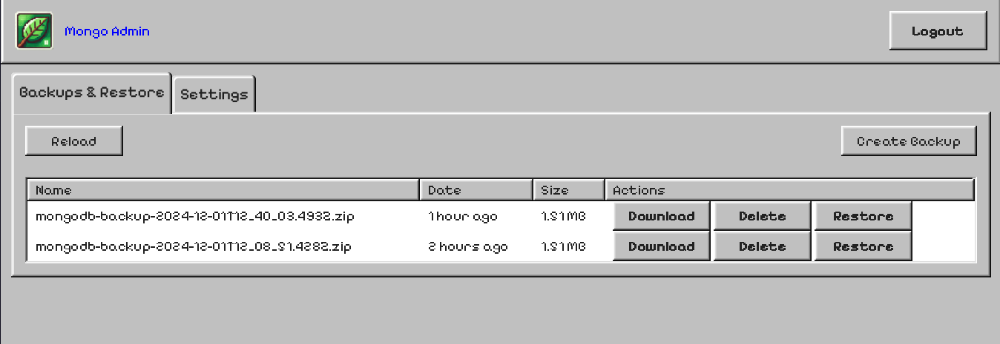
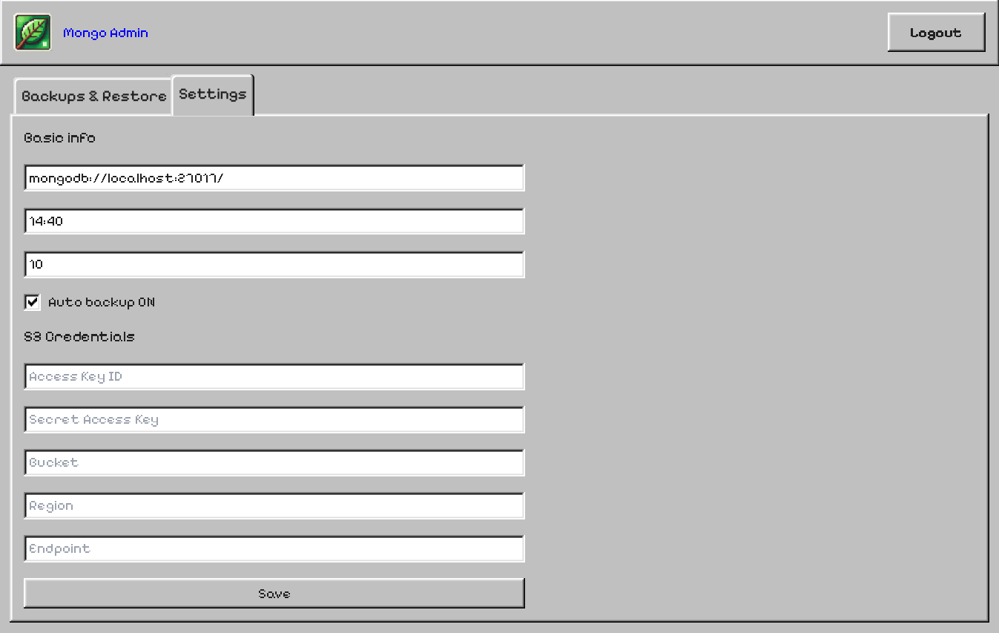

# Simple MONGO DB Backup Manager

> One docker image that contains `mongodb` (version 8) and webUI to manage your backups.

## Features
- Backup/Restore/Download your mongo db
- Schedule your backups
- S3 support

## Installation
```bash
sudo docker build -t mongo-backup-manager .

sudo docker run -d -p 4321:4321 -p 27017:27017 -v mongodb-data:/data/db -v backup-settings:/app/storage
 mongo-backup-manager
```

## Screenshots


